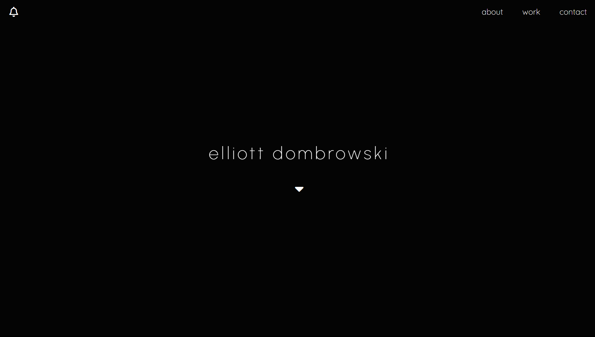
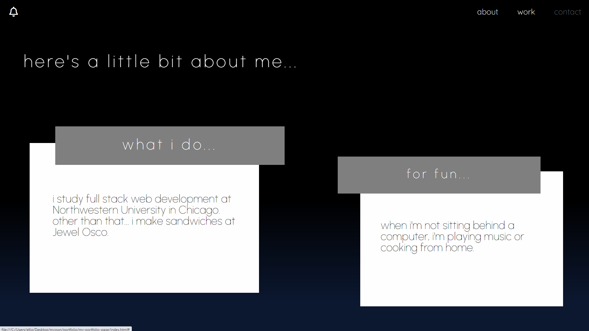

# my-portfolio-page

This is a portfolio page for my own use.

It displays several pages showing current information about me to the user, designed to fit in a single viewport at all times.

When the user clicks the arrow on the home page, they will be presented with a slideshow shifting through each page of the website.

If the user clicks the bell icon, they will be presented with a selection of social media links, including github and linked in.

## Deployed Link
https://elliottdombrowski.github.io/my-portfolio-page/

## Screenshots

## Future Developments
Future Developments include plans to clean up mobile responsiveness to make the design more uniform across varying screen sizes, as well as a "what i'm listening to" feature leveraging the Spotify API.
